<div align="center">

<p align="center">
  
</p>

# CareWave — Emergency Alert & Real-Time Public Safety System

> **Enterprise-Grade Distributed Emergency Dispatch, Live Telemetry & Disaster Alert Platform**  
> **Repository:** [https://github.com/saishsanas/CareWave](https://github.com/saishsanas/CareWave)  
> **Production API:** `https://carewave-backend-m2f1.onrender.com`  
> **Release Target:** Android Standalone Application (`com.carewave.app`)

[](https://openjdk.org/)
[](https://spring.io/projects/spring-boot)
[](https://reactnative.dev/)
[](https://expo.dev/)
[](https://kafka.apache.org/)
[](https://redis.io/)
[](https://www.mysql.com/)
[](https://firebase.google.com/)
[](https://resend.com/)

</div>

---

## 📋 Table of Contents
- [1. Problem Statement](#1-problem-statement)
- [2. Solution Overview](#2-solution-overview)
- [3. Key Features](#3-key-features)
- [4. System Architecture](#4-system-architecture)
- [5. Technology Stack](#5-technology-stack)
- [6. Authentication Flow](#6-authentication-flow)
- [7. SOS & Emergency Event Lifecycle](#7-sos--emergency-event-lifecycle)
- [8. Kafka Asynchronous Event Pipeline](#8-kafka-asynchronous-event-pipeline)
- [9. WebSocket Real-Time Tracking & Telemetry](#9-websocket-real-time-tracking--telemetry)
- [10. Database Architecture & Persistence Models](#10-database-architecture--persistence-models)
- [11. External Services & Cloud Integrations](#11-external-services--cloud-integrations)
- [12. Production Deployment](#12-production-deployment)
- [13. Android Release Artifact & Native Verification](#13-android-release-artifact--native-verification)
- [14. Application Screenshots](#14-application-screenshots)
- [15. Repository Structure](#15-repository-structure)
- [16. Local Setup & Execution](#16-local-setup--execution)
- [17. Environment Variables Configuration](#17-environment-variables-configuration)
- [18. Testing & Verification](#18-testing--verification)
- [19. Team & Technical Contributions](#19-team--technical-contributions)
- [20. Publications & Project Reports](#20-publications--project-reports)

---

## 1. Problem Statement

During critical personal emergencies, accidents, medical crises, and natural disasters, every second counts. Traditional emergency response mechanisms suffer from significant operational bottlenecks:
- **High Friction & Cognitive Overhead:** Victims under acute stress struggle to dial emergency numbers, articulate precise GPS locations, or notify multiple loved ones manually.
- **Synchronous Notification Delays:** Standard monolithic notification delivery blocks request threads, leading to dropped calls, network timeouts, or delayed alerts during mass-event surges.
- **Lack of Continuous Real-Time Telemetry:** First responders and family members receive static coordinates rather than real-time location streaming as an individual moves or seeks shelter.
- **Fragmented Incident Lifecycles:** Disconnects between incident triggering, contact dispatch, hospital discovery, and resolution lead to uncoordinated emergency response and prolonged panic.

---

## 2. Solution Overview

**CareWave** is an end-to-end emergency response platform combining an event-driven **Spring Boot 3.5.13** microservices backend with a cross-platform **React Native (Expo SDK 54)** mobile application. 

The platform guarantees sub-second emergency dispatch by decoupling HTTP client requests from push/email notifications through **Apache Kafka** event streaming. Active tracking sessions maintain ultra-low latency location broadcasts over **STOMP WebSockets** backed by in-memory **Redis/Valkey** caching, while authoritative audit trails and relationships are safely persisted in **MySQL**.

---

## 3. Key Features

- **🔐 Dual-Factor Passwordless Authentication:** Phone-first identity registration combined with time-sensitive email One-Time Passwords (OTP) and signed JSON Web Tokens (JWT).
- **📧 High-Reliability Email OTP:** Sub-second transactional OTP delivery via Resend HTTPS REST API, isolated from SMTP port blocking and throttled by sliding-window rate limiters.
- **📍 High-Accuracy Geolocation:** Native GPS coordinate acquisition (`expo-location`) with continuous tracking and telemetry transmission.
- **🚨 Instant Multi-Category SOS:** One-tap emergency triggers tailored to specific incident classes: Police, Medical, Fire, and General Emergency.
- **⚡ Decoupled Event Processing:** Non-blocking emergency dispatch powered by an Apache Kafka message broker ensuring zero request thread contention.
- **🔄 STOMP over WebSocket Real-Time Streaming:** Bi-directional telemetry synchronization streaming moving user coordinates to designated responders and family members.
- **🔔 Multi-Channel Alert Fan-Out:** Synchronized delivery across Firebase Cloud Messaging (FCM) high-priority push notifications and transactional emergency emails.
- **🛡️ Geofencing & Safe Zones:** Real-time boundary monitoring that alerts designated contacts immediately upon boundary breaches.
- **🤖 AI Emergency Assistant:** In-app emergency advisory powered by Google Gemini API providing contextual first-aid instructions during crisis situations.
- **✅ Emergency Resolution Lifecycle:** Controlled incident termination workflow enabling victims or responders to resolve emergencies, terminate tracking, and store audit logs.

---

## 4. System Architecture

The architecture enforces a strict separation of concerns, ensuring high availability, fault tolerance, and minimal response latency:

```
+-----------------------------------------------------------------------------------+
|                         CareWave Mobile Client (Android)                          |
|             React Native 0.81.5 / Expo SDK 54 / Hermes AOT / TypeScript          |
+-----------------------------------------------------------------------------------+
           |                                                      ^
    HTTPS REST Calls                                       STOMP / WSS
   (JWT Bearer Auth)                                    (Live Telemetry)
           |                                                      |
           v                                                      v
+-----------------------------------------------------------------------------------+
|                    Spring Boot 3.5.13 Enterprise Backend                          |
|                         Java 21 / Spring Security 6                               |
|                                                                                   |
|  [Security Filter Chain]  --->  [Sliding Window Rate Limiter]                     |
|  [REST API Controllers]   --->  [Service Business Logic]                         |
|  [WebSocket STOMP Broker] --->  [Location Tracking Manager]                       |
|  [Kafka Event Producer]   --->  Topic: `carewave-emergency-events`               |
+-----------------------------------------------------------------------------------+
       |                    |                     |                     |
       v                    v                     v                     v
+--------------+     +--------------+     +---------------+     +---------------+
|    MySQL     |     | Redis/Valkey |     | Apache Kafka  |     | External APIs |
| Relational   |     | In-Memory    |     | Distributed   |     | - Resend Email|
| Storage      |     | Cache        |     | Event Broker  |     | - Firebase FCM|
| - Users      |     | - Active Loc |     | - Async Event |     | - Gemini AI   |
| - Contacts   |     | - OTP Store  |     |   Consumer    |     | - Open-Meteo  |
| - Emergencies|     | - Rate Limits|     | - Notification|     | - USGS Quakes |
| - Safe Zones |     |   (TTL 5m)   |     |   Dispatch    |     |               |
+--------------+     +--------------+     +---------------+     +---------------+
```

---

## 5. Technology Stack

### **Backend Framework & Services**
| Component | Technology | Version | Purpose |
|---|---|---|---|
| Runtime | Java OpenJDK | 21 LTS | High-performance, modern LTS Java runtime |
| Framework | Spring Boot | 3.5.13 | Enterprise microservice framework |
| Security | Spring Security + JJWT | 6.x / 0.12.x | Stateless JWT authentication & authorization |
| Message Broker | Apache Kafka | 3.x | Decoupled, asynchronous emergency event dispatch |
| Primary Database | MySQL | 8.0 | Relational ACID storage and audit records |
| Ephemeral Cache | Redis / Valkey | 7.x | Sub-millisecond OTP store & live tracking cache |
| Real-Time Gateway | Spring STOMP | WebSocket | Full-duplex live location streaming protocol |
| Push Notifications | Firebase Admin SDK | 9.x | High-priority FCM push notification broadcast |
| Transactional Email| Resend HTTPS REST API | Latest | Robust email OTP and emergency alert delivery |
| AI Integration | Google Gemini API | 1.5 Flash | Emergency response assistance and advice |

### **Frontend & Mobile Client**
| Component | Technology | Version | Purpose |
|---|---|---|---|
| Framework | React Native | 0.81.5 | Native cross-platform mobile architecture |
| Toolchain | Expo SDK | 54 | Managed native prebuild & asset bundling |
| Language | TypeScript | 5.3+ | End-to-end static typing and interface contracts |
| JS Engine | Hermes | AOT | Ahead-of-time bytecode compilation for low cold-start latency |
| Mapping | `react-native-maps` | 1.18+ | Vector and satellite map rendering |
| Geolocation | `expo-location` | 18.x | High-accuracy device GPS tracking |
| Real-Time STOMP | `@stomp/stompjs` | 7.x | WebSocket client with automatic reconnection |
| Persistent Storage | AsyncStorage | 2.x | Encrypted client-side token preservation |

---

## 6. Authentication Flow

CareWave implements a frictionless, secure two-step phone + email OTP authentication model:

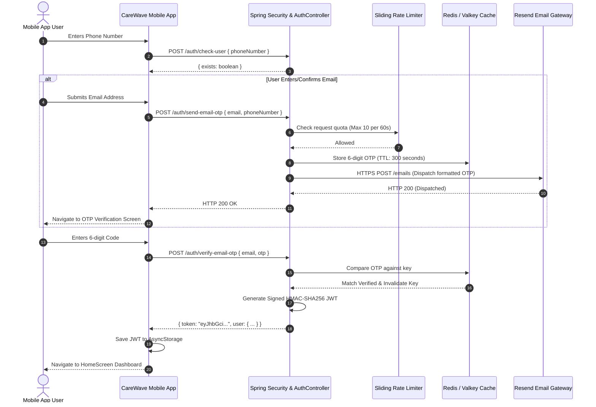

---

## 7. SOS & Emergency Event Lifecycle

When an emergency occurs, the platform executes a fail-safe, rapid response sequence:

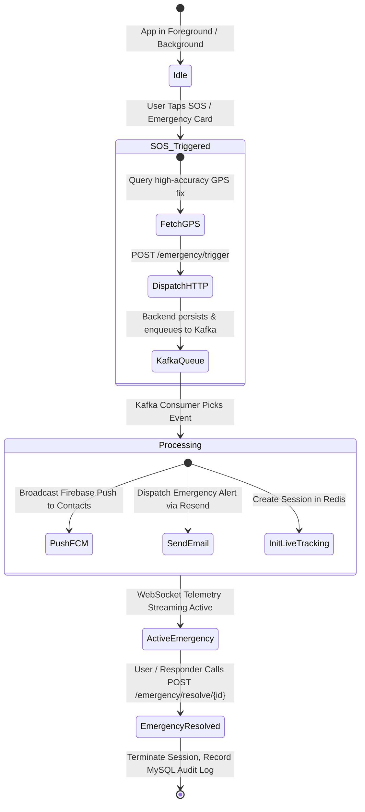

---

## 8. Kafka Asynchronous Event Pipeline

To ensure the mobile client receives an immediate `HTTP 200` response without waiting for external third-party network calls, all notification side-effects are decoupled using **Apache Kafka**:

- **Kafka Topic:** `carewave-emergency-events`
- **Dynamic Provisioning:** Managed by `KafkaAdmin` with automatic partition and replica discovery.
- **Security:** SASL/SCRAM with TLS encryption over Aiven Cloud Kafka.
- **Producer:** `EmergencyEventProducer` serializes the emergency payload (`emergencyId`, `userId`, `emergencyType`, `latitude`, `longitude`, `timestamp`).
- **Consumer:** `EmergencyEventConsumer` runs asynchronously with idempotent consumer processing:
  1. Resolves registered emergency contacts for the user.
  2. Generates FCM push notifications with urgent priority channel flags.
  3. Dispatches transactional alert emails containing direct coordinates and active tracking links via Resend.
  4. Manages failover retries without impacting the core HTTP thread pool.

---

## 9. WebSocket Real-Time Tracking & Telemetry

Continuous tracking utilizes STOMP protocol over secure WebSockets (`/ws`):

- **Handshake & Protocol:** Upgrades HTTP/HTTPS to WSS connection with fallback transports.
- **Inbound Destination:** `/app/track/send` — Client transmits device telemetry packets `{ sessionId, latitude, longitude, speed, heading, timestamp }`.
- **Outbound Broker Destination:** `/topic/tracking/{sessionId}` — Broadcasts real-time delta markers to all authenticated contacts viewing the live map.
- **High-Velocity Cache:** Telemetry coordinates are written to **Redis/Valkey** with sub-5ms latency, avoiding high-frequency database write bottlenecks.
- **Batch Synchronization:** Periodic background workers flush verified tracking points into MySQL `LiveTrackingSession` for post-incident audits and report generation.

---

## 10. Database Architecture & Persistence Models

CareWave employs a dual-tier persistence layer: **MySQL 8.0** for durable relational data and **Redis/Valkey** for high-throughput, volatile session state.

### Relational Schema (MySQL / JPA)
- `users`: Primary profile, phone identity, verified email, FCM token, created timestamp.
- `emergency_contacts`: User-to-contact relationships with trust levels and notification preferences.
- `emergencies`: Authoritative incident registry (`PENDING`, `ACTIVE`, `RESOLVED`, `CANCELLED`).
- `live_tracking_sessions`: Session metadata, initiator reference, start/end timestamps, resolution flags.
- `safe_zones`: Geofencing coordinates, radius definitions, active schedule masks.
- `breach_events`: Historical record of safe-zone perimeter entries and exits.
- `disaster_events`: Ingested natural disasters (earthquakes, severe storms) within vicinity zones.
- `notification_history`: Audit trail of all dispatched push notifications and emails.

### In-Memory Storage (Redis / Valkey)
- `otp:{email}`: 6-digit numeric OTP with an aggressive 300-second TTL.
- `tracking:{sessionId}`: Latest geographic coordinate cache for zero-latency subscriber reads.
- `ratelimit:{ip}`: Sliding-window request counter enforcing protection against brute-force attacks.

---

## 11. External Services & Cloud Integrations

| Provider | Service Role | Protocol / Mechanism | Verification Status |
|---|---|---|---|
| **Render** | Backend Cloud Hosting | Dockerized Spring Boot Web Service | Active (`carewave-backend-m2f1.onrender.com`) |
| **Aiven** | Managed Cloud Kafka & Redis | SASL_SSL / TLS over TCP | Active & Connected |
| **Firebase (Google)** | Cloud Messaging (FCM) | Firebase Admin SDK (Project `carewave-3705f`) | Configured & Operational |
| **Resend** | Transactional Email Delivery | HTTPS REST API (`api.resend.com/emails`) | Verified (Sub-second delivery) |
| **Google Gemini API** | AI Emergency Guidance | HTTPS REST API | Integrated in AI Assistant |
| **USGS Earthquake API**| Real-Time Seismic Ingestion | GeoJSON REST Polling Scheduler | Scheduled Task Active |
| **Open-Meteo API** | Severe Weather Alerts | REST Geocoded Forecast API | Scheduled Task Active |

---

## 12. Production Deployment

The backend service is containerized and continuously deployed on Render's container platform:

- **Production URL:** `https://carewave-backend-m2f1.onrender.com`
- **WebSocket Gateway:** `wss://carewave-backend-m2f1.onrender.com/ws`
- **Health Check Endpoint:** `GET /health` (Returns `HTTP 200 OK`)
- **JVM Configuration:** Multi-stage Docker build utilizing Eclipse Temurin OpenJDK 21, optimized memory limits, and non-root execution security.

---

## 13. Android Release Artifact & Native Verification

The Android client was compiled, signed, packaged, and verified through a complete production release audit.

### Release Artifact Details
- **APK Path:** `CareWave_Release/CareWave.apk`
- **File Size:** `96,577,436 bytes (~92.10 MB)`
- **SHA-256 Checksum:** `1DF8D579FC16BFD4D3F9BE506FC4CE129FC851D11DB509244096446F62C5B1C2`
- **Package Identifier:** `com.carewave.app`
- **Target SDK / Min SDK:** Target SDK 36, Compile SDK 36, Min SDK 24
- **Engine:** Hermes Bytecode Ahead-Of-Time (AOT)
- **Detailed Audit Document:** [`CareWave_Release/FINAL_RELEASE_AUDIT.md`](CareWave_Release/FINAL_RELEASE_AUDIT.md)

### Native Startup Order Optimization
In Expo SDK 54, the Hermes runtime initializes winter runtime patches before native core modules evaluate, which previously produced an unhandled `ReferenceError: Property 'FormData' doesn't exist` during cold boot. 

This was permanently resolved at the root entry point:
```typescript
// frontend/index.ts
// Ensure React Native core runtime and globals (FormData, performance, timers)
// are fully initialized before Expo packages and winter runtime evaluate.
import 'react-native/Libraries/Core/InitializeCore';
import { registerRootComponent } from 'expo';
import App from './App';

registerRootComponent(App);
```
- **Verification Result:** Zero crashes, clean ADB streaming install on `Medium_Phone_API_35` (`emulator-5554`), cold launch completed in under 990ms, active focus achieved (`mCurrentFocus=Window{... MainActivity}`).

---

## 14. Application Screenshots

### Production Release UI & Authentication

| 1. Mobile Phone Entry | 2. Dynamic Email Setup | 3. OTP Security Checkpoint |
|:---:|:---:|:---:|
| 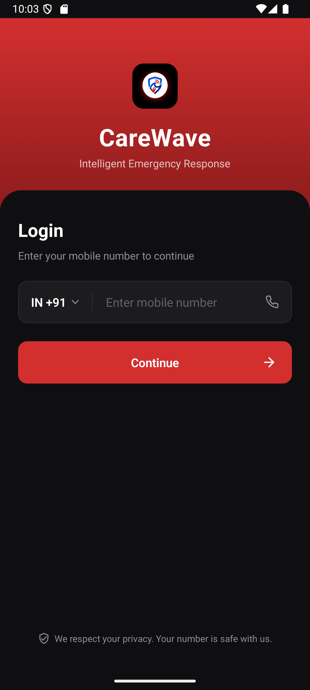 | 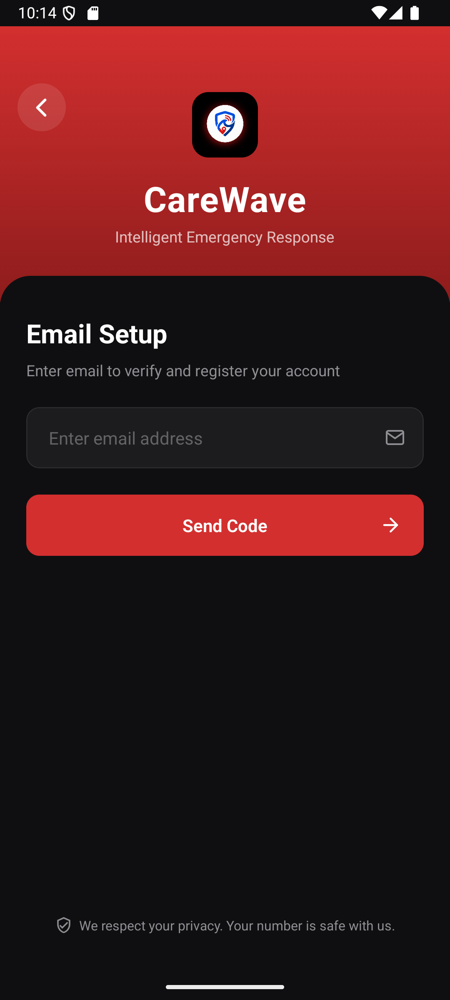 | 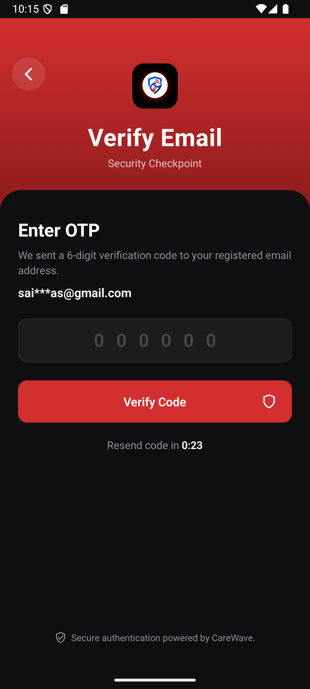 |
| Clean dark mode phone login with `+91` prefix validation | Dynamic transition capturing email for OTP dispatch | 6-digit OTP verification with active cooldown timer |

### Core Safety & Emergency Features

| 4. Primary Dashboard | 5. Active SOS Alert State | 6. Live Location Telemetry |
|:---:|:---:|:---:|
| 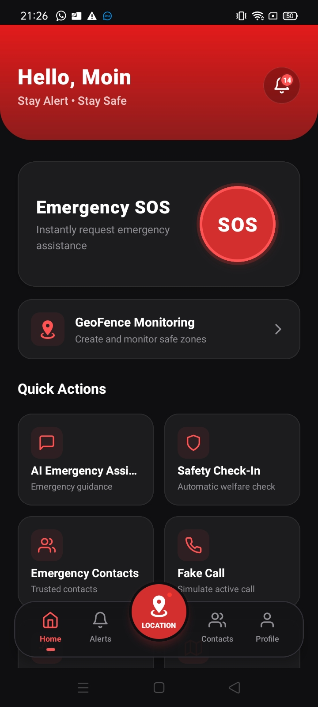 | 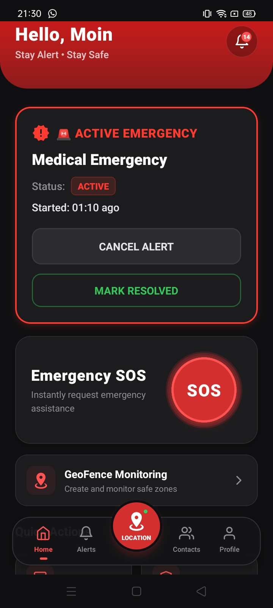 | 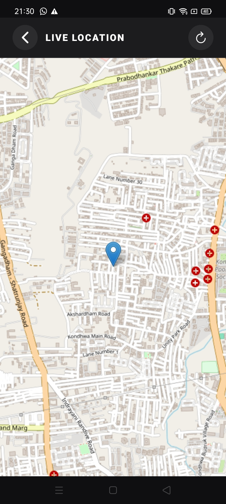 |
| Central SOS dispatch button & system status cards | Live visual alert banner during active emergency state | Full-screen vector map tracking live GPS coordinates |

| 7. Instant SOS Modal | 8. Nearby Hospitals | 9. AI Emergency Assistant |
|:---:|:---:|:---:|
| 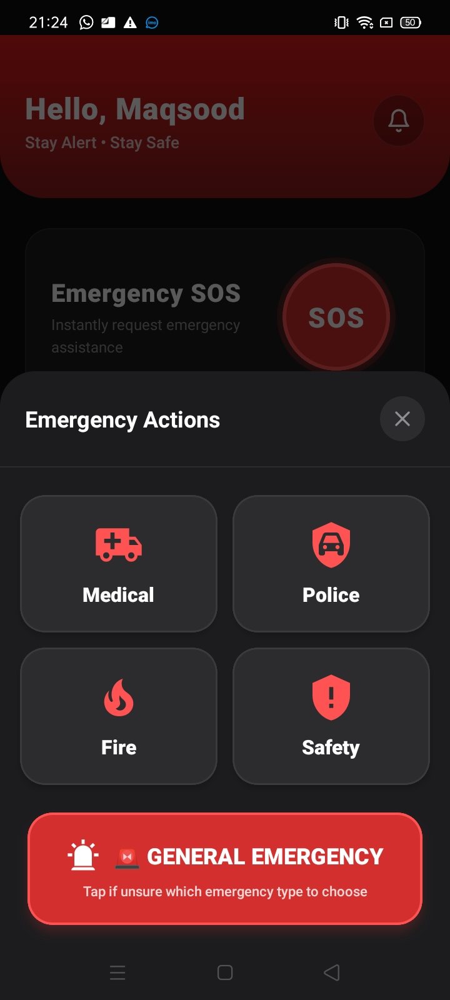 | 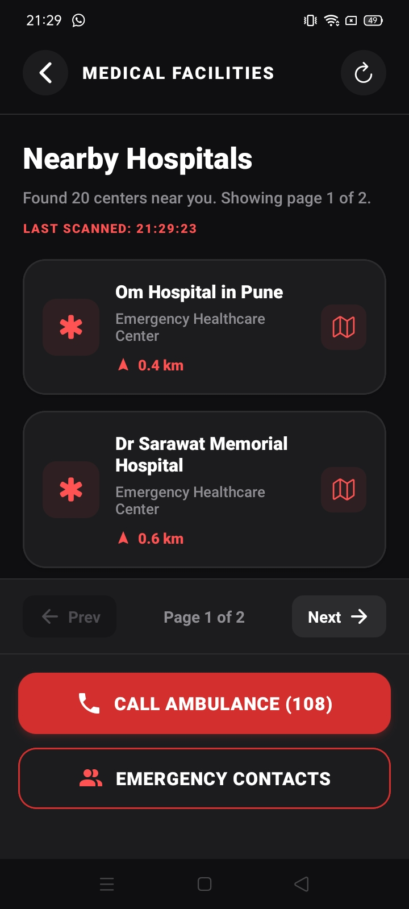 | 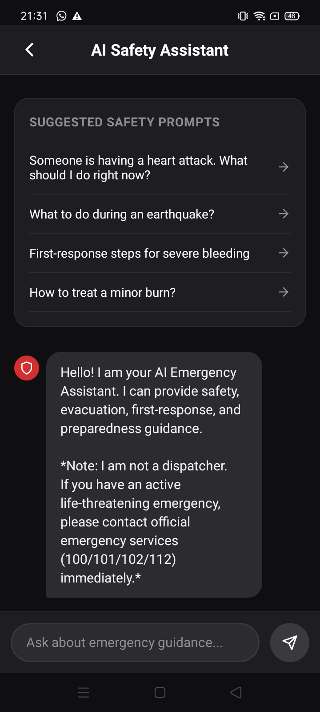 |
| One-tap emergency category selector | Proximity discovery of medical centers and contacts | Contextual guidance powered by Gemini AI API |

---

## 15. Repository Structure

```
CareWave/
├── backend/                                # Spring Boot 3.5.13 Backend Application
│   ├── src/
│   │   ├── main/java/com/CareWave/...      # Controllers, Services, Repositories, Entities, Configs
│   │   ├── main/resources/
│   │   │   ├── application.properties      # Central production-ready configuration
│   │   │   └── application-example.properties
│   │   └── test/java/com/CareWave/...      # Unit and integration test suites
│   ├── Dockerfile                          # Multi-stage production container build
│   ├── docker-compose.yml                  # Local development stack (MySQL, Redis, Kafka)
│   ├── pom.xml                             # Maven project dependencies
│   └── mvnw.cmd / mvnw                     # Maven wrapper scripts
├── frontend/                               # React Native (Expo SDK 54) Mobile Application
│   ├── src/
│   │   ├── components/                     # Reusable UI cards, modals, and buttons
│   │   ├── constants/                      # API URLs, Firebase client configs, themes
│   │   ├── screens/                        # Application screens (Auth, SOS, Maps, Alerts)
│   │   └── services/                       # API clients, WebSocket STOMP, GPS tracking
│   ├── assets/                             # Audio alerts, icons, and splash media
│   ├── app.json                            # Expo application configuration
│   ├── eas.json                            # Expo Application Services configuration
│   ├── google-services.json                # Firebase client configuration
│   ├── index.ts                            # Root bootstrap with InitializeCore fix
│   ├── package.json                        # Node dependencies
│   └── tsconfig.json                       # TypeScript compiler configuration
├── architecture/                           # Architectural flowcharts & block diagrams
├── assets/                                 # Brand assets and visual badges
├── CareWave_Release/                       # Verified release distribution package
│   ├── screenshots/                        # Android verified release captures
│   └── FINAL_RELEASE_AUDIT.md              # Complete APK audit & verification report
├── documents/                              # Academic project documentation & papers
│   ├── CareWave_BE_Project_Report.pdf      # Comprehensive final B.E. project report
│   ├── Carewave_ReviewPaper.pdf            # Academic review publication
│   ├── ResearchPaperCarewave.pdf           # Published research paper
│   └── workflows.md                        # Flowcharts and state diagrams
├── screenshots/                            # Showcase screen captures
├── .gitignore                              # Comprehensive repository exclusion rules
└── README.md                               # Project documentation
```

---

## 16. Local Setup & Execution

### Prerequisites
- **JDK 21 LTS** installed and configured in `PATH`
- **Node.js 18.x LTS+** and `npm`
- **Docker & Docker Compose** (for local MySQL, Redis, and Kafka)
- **Android Studio / Android SDK** (for native APK builds or emulator testing)

### 1. Start Local Infrastructure via Docker Compose
```bash
cd backend
docker-compose up -d
```
*This launches local instances of MySQL 8.0, Redis 7.x, and Apache Kafka.*

### 2. Run the Spring Boot Backend
```bash
cd backend
./mvnw clean compile
./mvnw spring-boot:run
```
*The backend starts on `http://localhost:8080`. Verify with `curl http://localhost:8080/health`.*

### 3. Run the Frontend Mobile Client
```bash
cd frontend
npm install
npx expo start
```
*Press `a` to launch the Android emulator or scan the QR code via Expo Go.*

---

## 17. Environment Variables Configuration

All secrets and environment-specific endpoints are managed via environment variables. **No credentials are baked into tracked source files.**

### Backend Environment Variables (`backend/.env` or Render Dashboard)

| Variable | Description | Safe Example Value |
|---|---|---|
| `PORT` | HTTP Server port | `8080` |
| `SPRING_DATASOURCE_URL` | JDBC MySQL connection URL | `jdbc:mysql://localhost:3306/carewave` |
| `SPRING_DATASOURCE_USERNAME` | MySQL database username | `carewave_user` |
| `CAREWAVE_DB_PASSWORD` | MySQL database password | `your_db_password_here` |
| `JWT_SECRET` | 256-bit secret key for HMAC-SHA256 | `your_secure_256bit_jwt_secret_key` |
| `SPRING_DATA_REDIS_HOST` | Redis cache hostname | `localhost` |
| `SPRING_DATA_REDIS_PORT` | Redis cache port | `6379` |
| `SPRING_DATA_REDIS_PASSWORD`| Redis authentication password | `your_redis_password` |
| `SPRING_KAFKA_BOOTSTRAP_SERVERS` | Kafka cluster broker addresses | `localhost:9092` |
| `RESEND_API_KEY` | Resend API key for email OTP dispatch | `re_1234567890abcdef` |
| `RESEND_FROM_EMAIL` | Sender email address for OTP | `onboarding@resend.dev` |
| `GEMINI_API_KEY` | Google Gemini API key for emergency chat| `your_gemini_api_key_here` |

### Frontend Environment Variables (`frontend/.env`)

| Variable | Description | Safe Example Value |
|---|---|---|
| `EXPO_PUBLIC_API_URL` | Backend HTTPS API URL | `https://carewave-backend-m2f1.onrender.com` |
| `EXPO_PUBLIC_WS_URL` | Backend WebSocket STOMP URL | `wss://carewave-backend-m2f1.onrender.com` |
| `EXPO_PUBLIC_FIREBASE_PROJECT_ID` | Firebase Project Identifier | `carewave-3705f` |

---

## 18. Testing & Verification

The CareWave platform has undergone multi-tiered verification spanning automated test suites, production smoke testing, and native Android packaging:

### 1. Automated Test Suite (JUnit 5 / Spring Boot Test)
All automated tests pass cleanly during Maven test execution:
- `CarewaveBackendApplicationTests`: Application context load and bean wiring verification.
- `AuthRateLimiterServiceTests`: Sliding-window rate limiter validation under simulated request bursts.
- `EmailOtpSystemTests`: Redis OTP storage, TTL expiration, and verification lifecycle.
- `EmailServiceResendTests`: Resend HTTPS REST client request construction and exception handling.
- `EmergencyServiceTests` & `EmergencyContactServiceTests`: Contact binding and incident state progression.
- `SafeZoneAndTrackingSystemTests`: Geofence boundary calculations and breach trigger algorithms.
- `EarthquakeDisasterAlertSystemTests` & `WeatherDisasterAlertSystemTests`: Disaster feed payload ingestion and filtering.
- `GeoFenceWorkflowSimulationTests`: End-to-end simulated user mobility across boundary thresholds.

### 2. Live Production Smoke Tests (`carewave-backend-m2f1.onrender.com`)
Verified against the live cloud deployment:
- ✅ **System Health:** `GET /health` returned `HTTP 200 OK`.
- ✅ **User Verification:** `POST /auth/check-user` returned `HTTP 200 OK`.
- ✅ **Email OTP Dispatch:** `POST /auth/send-email-otp` returned `HTTP 200 OK`, successfully delivering OTP to inbox via Resend.
- ✅ **Emergency Event Pipeline:** Event ingestion, Kafka dispatch to `carewave-emergency-events`, and lifecycle resolution tested.

### 3. Native Android Standalone Release Audit
- ✅ **R8 & Hermes Compilation:** Full native release packaging completed with zero ProGuard or CMake linking errors.
- ✅ **Cold Start & Foreground Focus:** Verified on Android emulator (`emulator-5554`) with zero fatal exceptions and active focus on `MainActivity`.
- ✅ **Initialization Integrity:** Zero `ReferenceError: Property 'FormData' doesn't exist` crashes via early `InitializeCore` execution.

---

## 19. Team & Technical Contributions

CareWave was developed as a Final-Year Bachelor of Engineering (B.E.) Capstone Project at Navsahyadri Group of Institutes (Savitribai Phule Pune University).

### **Project Team**
- **Saish Sanas** ([@saishsanas](https://github.com/saishsanas)) — **Team Lead, Backend & System Architect**
- **Moin Mankar** — Backend Developer
- **Mohd. Shaban Tabarak Ali** — Database Developer
- **Nakul Siricilla** — Frontend Developer
- **Prof. Vidya Rajput** — Project Guide & Academic Supervisor

### **My Architectural & Technical Contributions (Saish Sanas)**
- **System Architecture & Leadership:** Designed and directed the end-to-end event-driven architecture, led the engineering team, established Git workflows, and managed sprint delivery.
- **Backend Microservices Engineering:** Implemented the core Spring Boot 3.5.13 application, REST controllers, Spring Security authentication filters, and sliding-window rate limiters.
- **Asynchronous Kafka Event Pipeline:** Architected the decoupled emergency event publish/subscribe pipeline (`carewave-emergency-events`) ensuring sub-second response times.
- **Real-Time Telemetry & Caching:** Built the STOMP WebSocket location broadcasting service backed by in-memory Redis/Valkey session caching.
- **Third-Party Integrations:** Integrated Resend HTTPS API for resilient email OTP delivery, Firebase FCM Admin SDK for push notifications, and Gemini AI for emergency assistance.
- **Cloud Deployment & Android Release Engineering:** Containerized and deployed the backend on Render with Aiven Kafka/Valkey, optimized native Gradle/Hermes release compilation, and conducted the final production release verification.

---

## 20. Publications & Project Reports

The theoretical foundation and architectural performance benchmarks of CareWave are documented in published academic papers and project documentation located in `documents/`:

- 📘 **Final B.E. Project Report:** [`documents/CareWave_BE_Project_Report.pdf`](documents/CareWave_BE_Project_Report%20(8)%20(2).pdf)
- 📄 **Published Research Paper:** [`documents/ResearchPaperCarewave.pdf`](documents/ResearchPaperCarewave.pdf)
- 📄 **Review Paper:** [`documents/Carewave_ReviewPaper.pdf`](documents/Carewave_ReviewPaper.pdf)
- 📊 **Detailed Workflow Specifications:** [`documents/workflows.md`](documents/workflows.md)
- 📋 **Final Android Release Audit:** [`CareWave_Release/FINAL_RELEASE_AUDIT.md`](CareWave_Release/FINAL_RELEASE_AUDIT.md)

---

<div align="center">

**CareWave** — *Every Second Counts in Saving Lives.*  
© 2026 Saish Sanas & Team CareWave. All rights reserved.

</div>